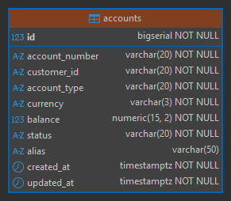

# 🏦 Definición del dominio: Gestión de Cuentas Bancarias

Esta documentación corresponde al proyecto `ms-accounts-webflux`.

---

## 📌 Descripción

Vamos a simular que trabajamos en un banco y nos asignan la tarea de implementar un `CRUD de cuentas bancarias`
siguiendo la estrategia de desarrollo `API First`.

Cada cuenta estará asociada a un cliente y tendrá atributos como:

- Número de cuenta
- Tipo de cuenta (ahorros, corriente)
- Moneda (PEN, USD, EUR)
- Saldo
- Estado (activo, bloqueado, cerrado)

### 📑 Endpoints iniciales

- `POST /accounts` → abrir cuenta
- `GET /accounts/{accountNumber}` → consultar cuenta
- `GET /accounts?customerId=...` → listar cuentas de un cliente
- `PATCH /accounts/{accountNumber}/status` → cambiar estado (activar/bloquear/cerrar)
- `DELETE /accounts/{accountNumber}` → cerrar cuenta

## 📬 Tarea #1 — Instrucciones del Tech Lead

> Imagina que es lunes por la mañana, primer día en Consultora Demo / Banco Demo. Tu Tech Lead se acerca y te dice:

Martín, bienvenido al equipo. Vamos a arrancarte con una tarea inicial para que te familiarices con nuestra forma
de trabajo.

Nosotros trabajamos con `API First`, así que lo primero que vas a hacer no es abrir `IntelliJ` ni escribir
una clase Java. **Lo primero es definir el contrato de la API.**

Aquí en el equipo usamos `OpenAPI 3.0` como estándar para escribir los contratos. Tú vas a diseñar el contrato para
el microservicio de `Gestión de Cuentas Bancarias`. Una vez que lo tengas, me lo mandas para revisarlo,
yo te doy el visto bueno, y recién ahí arrancas a codear.

El microservicio se llamará: `ms-accounts-webflux`

Por ahora solo necesito el contrato. Sin código Java todavía. ¿Entendido?

### 🗂️ Paso 1 — Estructura del proyecto raíz

Antes de escribir cualquier archivo, definamos la estructura de carpetas. Esto es lo que crearás en tu máquina.

````
api-first-project/                          ← Proyecto raíz
│
├── 📄 README.md                            ← Documentación general del proyecto raíz
│
├── ms-accounts-webflux/                    ← Microservicio con Spring WebFlux + R2DBC
│   │
│   ├── 📁 src/
│   │   ├── main/
│   │   │   ├── java/
│   │   │   └── resources/
│   │   └── test/
│   │
│   ├── 📁 contracts/                       ← ⭐ AQUÍ vive el contrato OpenAPI
│   │   └── openapi/
│   │       └── accounts-api.yaml           ← El contrato de la API
│   │
│   └── 📄 pom.xml
│
└── ms-accounts-webmvc/                     ← (Lo haremos después) Spring Web MVC
    └── ...
````

💡 ¿Por qué `contracts/openapi/` y no dentro de `resources/`?  
Buena pregunta, y es importante saberlo:

| Ubicación              | ¿Cuándo usarla?                                                                                                                                          |
|------------------------|----------------------------------------------------------------------------------------------------------------------------------------------------------|
| `src/main/resources/`  | Si el YAML solo se usa en runtime (Swagger UI lo sirve desde ahí)                                                                                        |
| `contracts/openapi/` ⭐ | **API First real**: el contrato es independiente del código. El plugin lo lee desde aquí para **generar código**. Es la convención en equipos enterprise |
| Repositorio separado   | En empresas grandes, el contrato vive en su propio repo (ej: `api-contracts-repo`) y se versiona independientemente                                      |

En Consultora Demo / Banco Demo lo más común es `contracts/` en la raíz del microservicio, o un repo dedicado solo para
contratos. Nosotros usaremos `contracts/openapi/` que es el balance perfecto para un proyecto real individual.

### 📐 Convenciones previas — Tipos en Java vs OpenAPI

A continuación veremos detalles previos antes de entrar al contrato OpenAPI.

#### 1️⃣ Tipos numéricos: `float`, `double`, `BigDecimal` en Java vs OpenAPI

| Java              | OpenAPI `type` | OpenAPI `format` | ¿Cuándo usarlo?                                                   |
|-------------------|----------------|------------------|-------------------------------------------------------------------|
| `float`           | `number`       | `float`          | Decimales de baja precisión, sensores, gráficas. **Nunca dinero** |
| `double`          | `number`       | `double`         | Decimales de media precisión. **Nunca dinero**                    |
| `BigDecimal`      | `number`       | — *(sin format)* | ✅ **Dinero, precisión financiera**                                |
| `int` / `Integer` | `integer`      | `int32`          | Enteros normales                                                  |
| `long` / `Long`   | `integer`      | `int64`          | Enteros grandes (IDs, timestamps)                                 |

> 💡 En OpenAPI, `format: double` le dice al generador de código que use `double` en Java. Si omites el `format` en
> un `type: number`, el generador suele usar `BigDecimal` por defecto, que es exactamente lo que queremos para dinero.

#### 2️⃣ Tipos de fecha: `LocalDateTime` vs `Instant` en Java vs OpenAPI

| Java             | OpenAPI `type` | OpenAPI `format` | Resultado                                  |
|------------------|----------------|------------------|--------------------------------------------|
| `LocalDate`      | `string`       | `date`           | `"2025-05-14"`                             |
| `LocalDateTime`  | `string`       | `date-time`      | `"2025-05-14T10:30:00"` ⚠️ sin zona        |
| `Instant`        | `string`       | `date-time`      | `"2025-05-14T10:30:00Z"` ✅ UTC             |
| `OffsetDateTime` | `string`       | `date-time`      | `"2025-05-14T10:30:00-05:00"` ✅ con offset |

> En OpenAPI siempre es `type: string` + `format: date-time` para fecha y hora. La diferencia la marca el
> ejemplo y la configuración del generador, no el YAML en sí.

### 📄 Paso 2 — El contrato OpenAPI `(accounts-api.yml)`

Este es el archivo que entregarás a tu Tech Lead para revisión. Léelo con calma, está comentado para que entiendas cada
sección.

````yml
openapi: 3.0.3

# ============================================================
# 📋 INFORMACIÓN GENERAL DE LA API
# Esto es lo primero que ven otros equipos (frontend, QA, etc.)
# ============================================================
info:
  title: Accounts API
  description: |
    Microservicio de Gestión de Cuentas Bancarias.
    Permite crear, consultar, actualizar el estado y eliminar
    cuentas bancarias asociadas a clientes del banco.
  version: 1.0.0
  contact:
    name: Equipo Backend - Consultora Demo
    email: backend-team@consultora-demo.example

# ============================================================
# 🌐 SERVIDORES
# Define en qué entornos está disponible la API
# ============================================================
servers:
  - url: http://localhost:8080/api/v1
    description: Servidor local de desarrollo
  - url: https://dev.banco-demo.example/api/v1
    description: Servidor de desarrollo (DEV)
  - url: https://staging.banco-demo.example/api/v1
    description: Servidor de pruebas (STAGING)

# ============================================================
# 🏷️ TAGS
# Agrupan los endpoints en secciones lógicas en Swagger UI
# ============================================================
tags:
  - name: Accounts
    description: Operaciones sobre cuentas bancarias

# ============================================================
# 🛣️ ENDPOINTS (paths)
# Aquí defines cada operación de tu API
# ============================================================
paths:

  /accounts:

    # ─── POST /accounts ────────────────────────────────────
    post:
      tags:
        - Accounts
      operationId: createAccount       # ⭐ Importante: el generador usará esto como nombre del método
      summary: Crear una nueva cuenta bancaria
      description: |
        Crea una nueva cuenta bancaria para un cliente existente.
        El número de cuenta es generado automáticamente por el sistema.
      requestBody:
        required: true
        content:
          application/json:
            schema:
              $ref: '#/components/schemas/AccountRequest'
            example:
              customerId: "CLI-00123"
              accountType: "SAVINGS"
              currency: "PEN"
              initialDeposit: 500.00
      responses:
        "201":
          description: Cuenta creada exitosamente
          content:
            application/json:
              schema:
                $ref: '#/components/schemas/AccountResponse'
        "400":
          $ref: '#/components/responses/BadRequest'
        "422":
          $ref: '#/components/responses/UnprocessableEntity'
        "500":
          $ref: '#/components/responses/InternalServerError'

    # ─── GET /accounts ─────────────────────────────────────
    get:
      tags:
        - Accounts
      operationId: listAccounts
      summary: Listar cuentas bancarias
      description: |
        Retorna la lista de cuentas bancarias.
        Se puede filtrar por cliente y/o por estado de la cuenta.
      parameters:
        - name: customerId
          in: query
          required: false
          description: ID del cliente para filtrar sus cuentas
          schema:
            type: string
            example: "CLI-00123"
        - name: status
          in: query
          required: false
          description: Estado de la cuenta para filtrar
          schema:
            $ref: '#/components/schemas/AccountStatus'
        - name: page
          in: query
          required: false
          description: Número de página (paginación)
          schema:
            type: integer
            default: 0
            minimum: 0
        - name: size
          in: query
          required: false
          description: Tamaño de página
          schema:
            type: integer
            default: 10
            minimum: 1
            maximum: 100
      responses:
        "200":
          description: Lista de cuentas obtenida exitosamente
          content:
            application/json:
              schema:
                $ref: '#/components/schemas/AccountPageResponse'
        "500":
          $ref: '#/components/responses/InternalServerError'

  /accounts/{accountNumber}:

    # ─── GET /accounts/{accountNumber} ─────────────────────
    get:
      tags:
        - Accounts
      operationId: getAccountByNumber
      summary: Obtener una cuenta por número de cuenta
      parameters:
        - $ref: '#/components/parameters/AccountNumberParam'
      responses:
        "200":
          description: Cuenta encontrada
          content:
            application/json:
              schema:
                $ref: '#/components/schemas/AccountResponse'
        "404":
          $ref: '#/components/responses/NotFound'
        "500":
          $ref: '#/components/responses/InternalServerError'

    # ─── PUT /accounts/{accountNumber} ─────────────────────
    put:
      tags:
        - Accounts
      operationId: updateAccount
      summary: Actualizar datos de una cuenta
      description: Permite actualizar la información editable de una cuenta bancaria.
      parameters:
        - $ref: '#/components/parameters/AccountNumberParam'
      requestBody:
        required: true
        content:
          application/json:
            schema:
              $ref: '#/components/schemas/AccountUpdateRequest'
      responses:
        "200":
          description: Cuenta actualizada exitosamente
          content:
            application/json:
              schema:
                $ref: '#/components/schemas/AccountResponse'
        "400":
          $ref: '#/components/responses/BadRequest'
        "404":
          $ref: '#/components/responses/NotFound'
        "422":
          $ref: '#/components/responses/UnprocessableEntity'
        "500":
          $ref: '#/components/responses/InternalServerError'

    # ─── DELETE /accounts/{accountNumber} ──────────────────
    delete:
      tags:
        - Accounts
      operationId: deleteAccount
      summary: Eliminar (dar de baja) una cuenta
      description: |
        Realiza una baja lógica de la cuenta (no eliminación física).
        La cuenta pasa al estado CLOSED.
      parameters:
        - $ref: '#/components/parameters/AccountNumberParam'
      responses:
        "204":
          description: Cuenta eliminada exitosamente (sin contenido)
        "404":
          $ref: '#/components/responses/NotFound'
        "500":
          $ref: '#/components/responses/InternalServerError'

  /accounts/{accountNumber}/status:

    # ─── PATCH /accounts/{accountNumber}/status ────────────
    patch:
      tags:
        - Accounts
      operationId: updateAccountStatus
      summary: Cambiar el estado de una cuenta
      description: |
        Permite activar, bloquear o cerrar una cuenta bancaria.
        Operación independiente del PUT para respetar el principio
        de responsabilidad única en los endpoints.
      parameters:
        - $ref: '#/components/parameters/AccountNumberParam'
      requestBody:
        required: true
        content:
          application/json:
            schema:
              $ref: '#/components/schemas/AccountStatusRequest'
            example:
              status: "BLOCKED"
              reason: "Solicitud del cliente por pérdida de tarjeta"
      responses:
        "200":
          description: Estado actualizado exitosamente
          content:
            application/json:
              schema:
                $ref: '#/components/schemas/AccountResponse'
        "400":
          $ref: '#/components/responses/BadRequest'
        "404":
          $ref: '#/components/responses/NotFound'
        "409":
          $ref: '#/components/responses/Conflict'
        "422":
          $ref: '#/components/responses/UnprocessableEntity'
        "500":
          $ref: '#/components/responses/InternalServerError'

# ============================================================
# 🧩 COMPONENTES REUTILIZABLES
# Schemas, responses y parameters que se referencian arriba
# ============================================================
components:

  # ── PARÁMETROS REUTILIZABLES ──────────────────────────────
  parameters:
    AccountNumberParam:
      name: accountNumber
      in: path
      required: true
      description: Número de cuenta bancaria (formato peruano CCI)
      schema:
        type: string
        pattern: '^\d{20}$'
        example: "00219100230000012345"

  # ── SCHEMAS (modelos de datos) ────────────────────────────
  schemas:

    # Enum de tipos de cuenta
    AccountType:
      type: string
      enum:
        - SAVINGS        # Cuenta de ahorros
        - CHECKING       # Cuenta corriente
        - FIXED_TERM     # Plazo fijo
      description: Tipo de cuenta bancaria

    # Enum de estados de cuenta
    AccountStatus:
      type: string
      enum:
        - ACTIVE         # Operativa
        - BLOCKED        # Bloqueada temporalmente
        - CLOSED         # Cerrada definitivamente
      description: Estado actual de la cuenta

    # Enum de monedas
    Currency:
      type: string
      enum:
        - PEN            # Soles peruanos
        - USD            # Dólares americanos
      description: Moneda de la cuenta

    # ── Request para CREAR cuenta ──
    AccountRequest:
      type: object
      required:
        - customerId
        - accountType
        - currency
      properties:
        customerId:
          type: string
          description: ID del cliente propietario de la cuenta
          minLength: 1
          maxLength: 20
          example: "CLI-00123"
        accountType:
          $ref: '#/components/schemas/AccountType'
        currency:
          $ref: '#/components/schemas/Currency'
        initialDeposit:
          type: number
          description: Depósito inicial (opcional, mínimo 0)
          minimum: 0
          default: 0.00
          example: 500.00

    # ── Request para ACTUALIZAR cuenta ──
    AccountUpdateRequest:
      type: object
      properties:
        alias:
          type: string
          description: Alias o apodo de la cuenta definido por el cliente
          maxLength: 50
          example: "Mi cuenta de ahorros"

    # ── Request para cambiar ESTADO ──
    AccountStatusRequest:
      type: object
      required:
        - status
      properties:
        status:
          $ref: '#/components/schemas/AccountStatus'
        reason:
          type: string
          description: Motivo del cambio de estado
          maxLength: 255
          example: "Solicitud del cliente"

    # ── Response completo de una CUENTA ──
    AccountResponse:
      type: object
      properties:
        # El cliente identifica la cuenta por accountNumber (clave de negocio UNIQUE)
        accountNumber:
          type: string
          description: Número de cuenta (20 dígitos)
          example: "00219100230000012345"
        customerId:
          type: string
          description: ID del cliente propietario
          example: "CLI-00123"
        accountType:
          $ref: '#/components/schemas/AccountType'
        currency:
          $ref: '#/components/schemas/Currency'
        balance:
          type: number
          description: Saldo actual de la cuenta
          example: 1250.75
        status:
          $ref: '#/components/schemas/AccountStatus'
        alias:
          type: string
          description: Alias de la cuenta
          example: "Mi cuenta de ahorros"
        createdAt:
          type: string
          format: date-time
          description: Fecha y hora de creación en UTC
          example: "2025-01-15T10:30:00Z"
        updatedAt:
          type: string
          format: date-time
          description: Fecha y hora de última actualización en UTC
          example: "2025-05-10T08:00:00Z"

    # ── Response paginado ──
    AccountPageResponse:
      type: object
      properties:
        content:
          type: array
          items:
            $ref: '#/components/schemas/AccountResponse'
          description: Lista de cuentas en la página actual
        pageNumber:
          type: integer
          description: Número de página actual (base 0)
          example: 0
        pageSize:
          type: integer
          description: Cantidad de elementos por página
          example: 10
        totalElements:
          type: integer
          format: int64
          description: Total de elementos en todas las páginas
          example: 35
        totalPages:
          type: integer
          description: Total de páginas disponibles
          example: 4
        first:
          type: boolean
          description: Indica si es la primera página
          example: true
        last:
          type: boolean
          description: Indica si es la última página
          example: false

    # ── Error estándar (alineado con ProblemDetail - RFC 7807) ──
    ProblemDetail:
      type: object
      properties:
        type:
          type: string
          format: uri
          description: URI que identifica el tipo de error
        title:
          type: string
          description: Título corto del error
        status:
          type: integer
          description: Código HTTP
        detail:
          type: string
          description: Descripción detallada del error
        instance:
          type: string
          format: uri
          description: URI de la instancia donde ocurrió el error
        timestamp:
          type: string
          format: date-time
        errors:
          type: array
          description: Lista de errores de validación (presente solo en 400)
          items:
            type: object
            properties:
              field:
                type: string
              message:
                type: string

  # ── RESPONSES REUTILIZABLES ───────────────────────────────
  responses:

    BadRequest:
      description: Datos de entrada inválidos (error de validación)
      content:
        application/problem+json:
          schema:
            $ref: '#/components/schemas/ProblemDetail'
          examples:
            validation-error:
              summary: Error de validación en campos
              value:
                type: "https://banco-demo.example/errors/validation-error"
                title: "Bad Request"
                status: 400
                detail: "Uno o más campos no superaron la validación"
                instance: "/api/v1/accounts"
                timestamp: "2025-05-14T10:30:00Z"
                errors:
                  - field: "customerId"
                    message: "El campo no puede estar vacío"
                  - field: "currency"
                    message: "Valor no permitido. Use: PEN, USD"
            malformed-request:
              summary: Petición mal formada
              value:
                type: "https://banco-demo.example/errors/malformed-request"
                title: "Bad Request"
                status: 400
                detail: "El cuerpo de la petición no es un JSON válido"
                instance: "/api/v1/accounts"
                timestamp: "2025-05-14T10:30:00Z"

    NotFound:
      description: Recurso no encontrado
      content:
        application/problem+json:
          schema:
            $ref: '#/components/schemas/ProblemDetail'
          examples:
            account-not-found:
              summary: Cuenta no encontrada
              value:
                type: "https://banco-demo.example/errors/account-not-found"
                title: "Not Found"
                status: 404
                detail: "No se encontró la cuenta con número 00219100230000012345"
                instance: "/api/v1/accounts/00219100230000012345"
                timestamp: "2025-05-14T10:30:00Z"

    Conflict:
      description: Conflicto con el estado actual del recurso
      content:
        application/problem+json:
          schema:
            $ref: '#/components/schemas/ProblemDetail'
          examples:
            invalid-status-transition:
              summary: Transición de estado en conflicto
              value:
                type: "https://banco-demo.example/errors/invalid-status-transition"
                title: "Conflict"
                status: 409
                detail: "La cuenta ya se encuentra en estado BLOCKED"
                instance: "/api/v1/accounts/00219100230000012345/status"
                timestamp: "2025-05-14T10:30:00Z"

    UnprocessableEntity:
      description: Regla de negocio no cumplida
      content:
        application/problem+json:
          schema:
            $ref: '#/components/schemas/ProblemDetail'
          examples:

            # Ejemplo para POST /accounts
            max-accounts-reached:
              summary: "[POST] Cliente alcanzó el máximo de cuentas permitidas"
              value:
                type: "https://banco-demo.example/errors/business-rule-violation"
                title: "Unprocessable Entity"
                status: 422
                detail: "El cliente CLI-00123 ya tiene el máximo de cuentas permitidas"
                instance: "/api/v1/accounts"
                timestamp: "2025-05-14T10:30:00Z"

            # Ejemplo para PUT /accounts/{accountNumber}
            alias-not-allowed-on-closed:
              summary: "[PUT] No se puede modificar una cuenta cerrada"
              value:
                type: "https://banco-demo.example/errors/business-rule-violation"
                title: "Unprocessable Entity"
                status: 422
                detail: "No se permite modificar el alias de una cuenta en estado CLOSED"
                instance: "/api/v1/accounts/00219100230000012345"
                timestamp: "2025-05-14T10:30:00Z"

            # Ejemplo para PATCH /accounts/{accountNumber}/status
            closed-account-cannot-reactivate:
              summary: "[PATCH] No se puede reactivar una cuenta cerrada"
              value:
                type: "https://banco-demo.example/errors/business-rule-violation"
                title: "Unprocessable Entity"
                status: 422
                detail: "No se puede activar una cuenta que está CLOSED"
                instance: "/api/v1/accounts/00219100230000012345/status"
                timestamp: "2025-05-14T10:30:00Z"

    InternalServerError:
      description: Error interno del servidor
      content:
        application/problem+json:
          schema:
            $ref: '#/components/schemas/ProblemDetail'
          examples:
            unexpected-error:
              summary: Error inesperado del servidor
              value:
                type: "https://banco-demo.example/errors/internal-error"
                title: "Internal Server Error"
                status: 500
                detail: "Ocurrió un error inesperado. Por favor contacte al administrador"
                instance: "/api/v1/accounts"
                timestamp: "2025-05-14T10:30:00Z"
````

### ✅ Revisión del Tech Lead

> Al día siguiente tu Tech Lead revisa el contrato y te escribe:

Martín, muy bien. El contrato está aprobado y versionado. Algunas cosas que hiciste bien y quiero que las tengas claras:

- ✅ Usaste `operationId` en cada endpoint — fíjate que estableciste valores como `createAccount`, `listAccounts`,
  `getAccountByNumber`, etc. Cuando usemos librerías para generar el código, este será el nombre del método en tu
  Interface Java.
- ✅ Separaste el `PATCH /status` del `PUT` — buena práctica de diseño REST.
- ✅ El error usa `ProblemDetail` alineado con `RFC 7807` — es el estándar que usamos.
- ✅ Los `$ref` evitan repetición — el contrato es limpio y mantenible.
- ✅ El `content-type` de errores es `application/problem+json` — correcto.

Siguiente paso: Ahora sí abres IntelliJ. Vas a crear el proyecto Spring Boot y configurar el plugin que leerá este
contrato para generar las interfaces automáticamente. Ese código generado es el que implementarás. No toques el YAML ya
aprobado salvo que pase por revisión nuevamente.

## 🏦 Tarea #2 — Inicialización del Proyecto y Preparación del Entorno

### 📋 Stack del proyecto

| Tecnología                         | Versión              | Rol                                    |
|------------------------------------|----------------------|----------------------------------------|
| **Java**                           | 25                   | Lenguaje                               |
| **Spring Boot**                    | 4.0.6                | Framework base                         |
| **Spring WebFlux**                 | (incluido en Boot 4) | Capa web reactiva                      |
| **Spring Data R2DBC**              | (incluido en Boot 4) | Persistencia reactiva                  |
| **Spring Validation**              | (incluido en Boot 4) | Validaciones con Bean Validation       |
| **PostgreSQL**                     | 17                   | Base de datos                          |
| **R2DBC PostgreSQL Driver**        | (compatible Boot 4)  | Driver reactivo para Postgres          |
| **Lombok**                         | (compatible Boot 4)  | Reducción de boilerplate               |
| **MapStruct**                      | 1.6.x                | Mapeo entre entidades y DTOs           |
| **openapi-generator-maven-plugin** | 7.22.0               | Generación de interfaces desde el YAML |
| **springdoc-openapi-webflux-ui**   | (compatible Boot 4)  | Swagger UI para WebFlux                |

> ⚠️ **Una advertencia importante antes de arrancar**  
> Existe un issue abierto sobre compatibilidad del generador con Spring Boot 4 y Jackson 3 para algunos modos
> de generación. Esto es relevante porque Spring Boot 4 usa Jackson 3 por defecto.
>
> El `openapi-generator-maven-plugin` puede operar en dos modos:
> - **Server stub** → genera las interfaces Java que tú implementas en tu backend ← **nuestro caso**.
> - **Client** → genera código Java empaquetado como `.jar` para que *otro microservicio* pueda consumir tu API sin
    escribir la integración a mano.
>
> El issue de compatibilidad afecta principalmente al modo **client**. Para nuestro caso usaremos el modo
> **server stub** con generador de tipo `spring` y `reactive: true`, que genera las interfaces reactivas
> (`Mono`, `Flux`) que implementaremos con Spring WebFlux. Este modo no presenta ese problema y
> lo configuraremos correctamente en el `pom.xml`.

### Dependencias del proyecto

El proyecto lo generamos desde
[Spring Initializr](https://start.spring.io/#!type=maven-project&language=java&platformVersion=4.0.6&packaging=jar&configurationFileFormat=yaml&jvmVersion=25&groupId=dev.magadiflo&artifactId=ms-accounts-webflux&packageName=dev.magadiflo.accounts.app&dependencies=webflux,data-r2dbc,postgresql,validation,lombok)
con las siguientes dependencias:

````xml
<!--Spring Boot 4.0.6-->
<!--Java 25-->
<!--org.mapstruct.version 1.6.3-->
<!--lombok-mapstruct-binding.version 0.2.0-->
<dependencies>
    <dependency>
        <groupId>org.springframework.boot</groupId>
        <artifactId>spring-boot-starter-data-r2dbc</artifactId>
    </dependency>
    <dependency>
        <groupId>org.springframework.boot</groupId>
        <artifactId>spring-boot-starter-validation</artifactId>
    </dependency>
    <dependency>
        <groupId>org.springframework.boot</groupId>
        <artifactId>spring-boot-starter-webflux</artifactId>
    </dependency>

    <!--Agregado manualmente-->
    <dependency>
        <groupId>org.mapstruct</groupId>
        <artifactId>mapstruct</artifactId>
        <version>${org.mapstruct.version}</version>
    </dependency>
    <!--Springdoc OpenAPI - Swagger UI para WebFlux-->
    <dependency>
        <groupId>org.springdoc</groupId>
        <artifactId>springdoc-openapi-starter-webflux-ui</artifactId>
        <version>3.0.3</version>
    </dependency>
    <!--/Agregado manualmente-->

    <dependency>
        <groupId>org.postgresql</groupId>
        <artifactId>postgresql</artifactId>
        <scope>runtime</scope>
    </dependency>
    <dependency>
        <groupId>org.postgresql</groupId>
        <artifactId>r2dbc-postgresql</artifactId>
        <scope>runtime</scope>
    </dependency>
    <dependency>
        <groupId>org.projectlombok</groupId>
        <artifactId>lombok</artifactId>
        <optional>true</optional>
    </dependency>
    <dependency>
        <groupId>org.springframework.boot</groupId>
        <artifactId>spring-boot-starter-data-r2dbc-test</artifactId>
        <scope>test</scope>
    </dependency>
    <dependency>
        <groupId>org.springframework.boot</groupId>
        <artifactId>spring-boot-starter-validation-test</artifactId>
        <scope>test</scope>
    </dependency>
    <dependency>
        <groupId>org.springframework.boot</groupId>
        <artifactId>spring-boot-starter-webflux-test</artifactId>
        <scope>test</scope>
    </dependency>
</dependencies>
````

### 📖 Dependencia: `springdoc-openapi-starter-webflux-ui`

Esta dependencia habilita la **interfaz gráfica Swagger UI** en nuestro microservicio, permitiendo visualizar e
interactuar con los endpoints de la API directamente desde el navegador. Internamente, `springdoc-openapi` escanea el
proyecto en tiempo de ejecución e infiere la documentación a partir de las interfaces generadas por el plugin
`openapi-generator-maven-plugin`.

````xml
<!--Springdoc OpenAPI - Swagger UI para WebFlux-->
<dependency>
    <groupId>org.springdoc</groupId>
    <artifactId>springdoc-openapi-starter-webflux-ui</artifactId>
    <version>3.0.3</version>
</dependency>
````

Una vez levantado el proyecto, `Swagger UI` estará disponible en:

- 📄 Especificación JSON/YAML: `http://localhost:8080/v3/api-docs`
- 🖥️ Interfaz gráfica: `http://localhost:8080/swagger-ui.html`

> ⚠️ **Nota de compatibilidad importante:** `springdoc-openapi` maneja dos líneas de versiones según el Spring Boot que
> uses:
>
> | springdoc versión | Spring Boot compatible |
> |---|---|
> | `2.x.x` | Spring Boot 3.x |
> | `3.x.x` ← **nuestra versión** | Spring Boot 4.x |
>
> La mayoría de tutoriales en internet usan la versión `2.x.x` porque fueron escritos para Spring Boot 3.
> Si ves un ejemplo con `springdoc-openapi-starter-webflux-ui version 2.x.x`, ten en cuenta que **no es compatible
> con Spring Boot 4** y causará errores en runtime relacionados con la reubicación de clases de autoconfiguración
> que ocurrió en Spring Boot 4.

### 🔌 Plugin: `maven-compiler-plugin` — Binding entre Lombok y MapStruct

En nuestro proyecto usamos **Lombok** para eliminar código boilerplate (getters, setters, constructores, etc.) y
**MapStruct** para mapear entre entidades y DTOs. Ambas librerías funcionan mediante **procesadores de anotaciones**
que se ejecutan en tiempo de compilación, es decir, antes de que el compilador de Java genere el bytecode final.

El problema es que existe una **dependencia de orden** entre ellos:

> MapStruct necesita que Lombok ya haya generado los getters y setters **antes** de intentar usarlos para construir
> los mappers.

Si el orden es incorrecto, MapStruct intentaría acceder a métodos que aún no existen y el build fallaría.
Para resolver esto, configuramos el`maven-compiler-plugin` indicándole explícitamente el orden de ejecución de los
procesadores mediante `<annotationProcessorPaths>`: primero Lombok, luego MapStruct, y finalmente el binding que
coordina la comunicación entre ambos.

````xml

<project>
    <properties>
        <java.version>25</java.version>
        <!--Agregado manualmente-->
        <org.mapstruct.version>1.6.3</org.mapstruct.version>
        <lombok-mapstruct-binding.version>0.2.0</lombok-mapstruct-binding.version>
        <!--/Agregado manualmente-->
    </properties>

    <!--MapStruct-->
    <plugin>
        <groupId>org.apache.maven.plugins</groupId>
        <artifactId>maven-compiler-plugin</artifactId>
        <version>${maven-compiler-plugin.version}</version>
        <configuration>
            <source>${java.version}</source>
            <target>${java.version}</target>
            <annotationProcessorPaths>
                <path>
                    <groupId>org.projectlombok</groupId>
                    <artifactId>lombok</artifactId>
                    <version>${lombok.version}</version>
                </path>
                <path>
                    <groupId>org.mapstruct</groupId>
                    <artifactId>mapstruct-processor</artifactId>
                    <version>${org.mapstruct.version}</version>
                </path>
                <path>
                    <groupId>org.projectlombok</groupId>
                    <artifactId>lombok-mapstruct-binding</artifactId>
                    <version>${lombok-mapstruct-binding.version}</version>
                </path>
            </annotationProcessorPaths>
        </configuration>
    </plugin>
    <!--/MapStruct-->
</project>
````

### 🔌 Plugin: `openapi-generator-maven-plugin`

Este plugin es el **corazón de la estrategia API First**. Su responsabilidad es leer el contrato `accounts-api.yml`
que definimos y aprobamos, y generar automáticamente las interfaces Java que implementaremos en nuestros controllers.
Así garantizamos que el código siempre respete el contrato y no al revés.

````xml
<!--OpenAPI Generator-->
<plugin>
    <groupId>org.openapitools</groupId>
    <artifactId>openapi-generator-maven-plugin</artifactId>
    <version>7.22.0</version>
    <executions>
        <execution>
            <goals>
                <goal>generate</goal>
            </goals>
            <configuration>
                <inputSpec>${project.basedir}/contracts/openapi/accounts-api.yml</inputSpec>
                <generatorName>spring</generatorName>
                <apiPackage>dev.magadiflo.accounts.app.api</apiPackage>
                <modelPackage>dev.magadiflo.accounts.app.model</modelPackage>
                <output>${project.build.directory}/generated-sources/openapi</output>
                <generateSupportingFiles>false</generateSupportingFiles>
                <configOptions>
                    <reactive>true</reactive>
                    <useSpringBoot3>true</useSpringBoot3>
                    <interfaceOnly>true</interfaceOnly>
                    <dateLibrary>java8</dateLibrary>
                    <openApiNullable>false</openApiNullable>
                    <skipDefaultInterface>true</skipDefaultInterface>
                    <useTags>true</useTags>
                </configOptions>
                <typeMappings>
                    <typeMapping>DateTime=Instant</typeMapping>
                </typeMappings>
                <importMappings>
                    <importMapping>Instant=java.time.Instant</importMapping>
                </importMappings>
            </configuration>
        </execution>
    </executions>
</plugin>
        <!--/OpenAPI Generator-->
````

| Campo        | Valor                            | Descripción                                           |
|--------------|----------------------------------|-------------------------------------------------------|
| `groupId`    | `org.openapitools`               | Organización que mantiene el plugin                   |
| `artifactId` | `openapi-generator-maven-plugin` | Nombre del plugin                                     |
| `version`    | `7.22.0`                         | Versión usada, compatible con Spring Boot 4 y Java 25 |

#### ⚙️ `<execution>` — ¿Qué es y por qué está aquí?

```xml

<execution>
    <goals>
        <goal>generate</goal>
    </goals>
</execution>
```

Un `<execution>` en Maven indica **cuándo y qué ejecutar** durante el ciclo de vida del build.
En este caso le decimos a Maven:

> *"Durante el build, ejecuta el goal `generate` de este plugin"*

El goal `generate` es el que dispara la lectura del YAML y la generación del código Java.
Sin esta sección, el plugin estaría declarado pero nunca se ejecutaría.

#### 📁 `<inputSpec>` — La fuente de verdad

```
${project.basedir}/contracts/openapi/accounts-api.yml
```

Le indica al plugin **dónde está el contrato OpenAPI** que debe leer para generar el código.

- `${project.basedir}` es una variable Maven que apunta a la **raíz del proyecto** (donde está el `pom.xml`),
  en nuestro caso: `ms-accounts-webflux/`.
- La ruta completa resultante sería: `ms-accounts-webflux/contracts/openapi/accounts-api.yml`.
- Esta ubicación (`contracts/openapi/`) es la **convención enterprise** para proyectos API First: el contrato vive
  fuera de `src/` porque es independiente del código, es un artefacto de diseño que se versiona y aprueba por separado.

#### 🏷️ `<generatorName>spring</generatorName>` — El tipo de generador

> ❓ **¿Siempre debe ser `spring` o es un nombre cualquiera?**

**No es un nombre cualquiera.** Es un identificador que le dice al plugin **qué generador usar** de entre los muchos
que ofrece `openapi-generator`. Cada generador produce código para un lenguaje o framework diferente.
Algunos ejemplos:

| `generatorName`         | ¿Qué genera?                                               |
|-------------------------|------------------------------------------------------------|
| `spring`                | Código Java para Spring (MVC o WebFlux) ← **nuestro caso** |
| `java`                  | Código Java genérico (sin Spring)                          |
| `kotlin-spring`         | Código Kotlin para Spring                                  |
| `nodejs-express-server` | Código JavaScript con Express                              |
| `python-flask`          | Código Python con Flask                                    |
| `go-server`             | Código Go                                                  |

Al usar `spring`, el plugin sabe que debe generar interfaces con anotaciones de Spring como `@RequestMapping`,
`@RestController`, etc., y con las opciones que configuramos en `<configOptions>` adaptará esas interfaces para
WebFlux reactivo.

#### 📦 `<apiPackage>` — Paquete de las interfaces generadas

```
dev.magadiflo.accounts.app.api
```

Define el **paquete Java** donde se generarán las interfaces de los controllers. Con nuestra configuración,
el generador creará algo como:

```java
package dev.magadiflo.accounts.app.api;

public interface AccountsApi {
    Mono<ResponseEntity> createAccount(/* params */);

    Mono<ResponseEntity> getAccountByNumber(/* params */);
    /* Los demás métodos del contrato */
}
```

> 💡 El nombre de la interfaz (`AccountsApi`) lo deriva del tag `Accounts` que
> definimos en nuestro `accounts-api.yml`. Aquí es donde entra la opción `<useTags>true</useTags>`
> que veremos más adelante.

#### 📦 `<modelPackage>` — Paquete de los DTOs generados

```
dev.magadiflo.accounts.app.model
```

Define el **paquete Java** donde se generarán los DTOs (clases de request y response).
El generador leerá todos los `schemas` definidos en `components/schemas` de nuestro
YAML y creará las clases correspondientes:

```java
package dev.magadiflo.accounts.app.model;

public class AccountRequest {
    /* code */
}

public class AccountResponse {
    /* code */
}

public class AccountPageResponse {
    /* code */
}

public class AccountStatusRequest {
    /* code */
}

public class AccountUpdateRequest {
    /* code */
}

public class ProblemDetail {
    /* code */
}

// Enums también:
public enum AccountType {SAVINGS, CHECKING, FIXED_TERM}

public enum AccountStatus {ACTIVE, BLOCKED, CLOSED}

public enum Currency {PEN, USD}
```

#### 📂 `<output>` — Dónde se deposita el código generado

```
${project.build.directory}/generated-sources/openapi
```

Define **dónde escribir** los archivos Java generados.

- `${project.build.directory}` es una variable Maven que apunta a la carpeta `target/` del proyecto.
- La ruta completa resultante es: `target/generated-sources/openapi/`.
- `target/generated-sources/` es la **convención estándar de Maven** para código generado automáticamente.
  IntelliJ IDEA reconoce esta ubicación automáticamente y la marca como **Source Root**, lo que significa que el
  compilador la incluye sin configuración adicional.
- El subdirectorio `/openapi` es buena práctica para aislar el código generado por este plugin de otros posibles
  generadores en el proyecto.

> ⚠️ **Importante:** Este código en `target/` **no se commitea a Git**. Es generado en cada build. Por eso `target/`
> siempre está en el `.gitignore`. El contrato `accounts-api.yml` es lo que sí se versiona, no el código generado.

#### 🚫 `<generateSupportingFiles>false</generateSupportingFiles>` — Evitar archivos innecesarios

Por defecto, el generador produce no solo las interfaces y modelos sino también **archivos de soporte** que no
necesitamos porque ya los tenemos en nuestro proyecto:

- `Application.java` ← ya tenemos la nuestra
- `pom.xml` interno ← ya tenemos el nuestro
- `README.md` genérico
- Archivos de configuración de Spring genéricos
- `ApiUtil.java` y otros helpers

Al poner `false`, le decimos: **"solo genera las interfaces API y los modelos, nada más"**. Esto mantiene el código
generado limpio y evita conflictos con los archivos que ya tenemos.

#### ⚡ `<reactive>true</reactive>` — Habilitar WebFlux reactivo

Esta es una de las opciones más importantes para nuestro proyecto. Al activarla, el generador produce interfaces
reactivas con **Project Reactor** en lugar de métodos bloqueantes tradicionales:

```java
// Sin reactive: false (Spring MVC tradicional) ❌ no es nuestro caso
ResponseEntity createAccount(AccountRequest body);

// Con reactive: true (Spring WebFlux) ✅ nuestro caso
Mono<ResponseEntity> createAccount(Mono body);

Flux listAccounts(/*...*/);
```

El generador usará `Mono<T>` para operaciones que retornan un solo elemento y `Flux<T>` para colecciones, que es
exactamente el modelo de programación reactiva de `Spring WebFlux` con `Project Reactor`.

#### 🏷️ `<useSpringBoot3>true</useSpringBoot3>` — Jakarta EE

> ❓ **¿Esto significa que estoy usando Spring Boot 3? Nosotros usamos Spring Boot 4.**

**No.** El nombre de esta opción es histórico y puede confundir. Lo que realmente
activa es el uso del **namespace `jakarta.*`** en lugar de `javax.*`:

```java
// Con useSpringBoot3: false (Spring Boot 2 y anteriores) ❌

import javax.validation.constraints.NotNull;
import javax.validation.Valid;

// Con useSpringBoot3: true (Spring Boot 3 en adelante, incluido Spring Boot 4) ✅
import jakarta.validation.constraints.NotNull;
import jakarta.validation.Valid;
```

A partir de **Spring Boot 3**, Spring migró de `javax.*` (Java EE) a `jakarta.*`
(Jakarta EE) como parte de la migración a Jakarta EE 9+. Spring Boot 4 continúa
con `jakarta.*`. Si no activamos esta opción, el código generado usaría `javax.*`
y **no compilaría** con Spring Boot 4.

> 💡 Piénsalo como: *"genera código compatible con Spring Boot 3 o superior"*, no literalmente
> *"estoy usando Spring Boot 3"*.

#### 🎯 `<interfaceOnly>true</interfaceOnly>` — El patrón API First

Esta opción es **fundamental para la estrategia API First**. Sin ella, el generador
produciría no solo la interfaz sino también una implementación concreta del controller,
sobreescribiendo tu trabajo en cada build.

Con `true`, el generador produce **solo la interfaz**:

```java
// ✅ Solo esto se genera → AccountsApi.java (interfaz)
public interface AccountsApi {
    @PostMapping("/accounts")
    Mono<ResponseEntity> createAccount(...);
}
```

Y tú implementas esa interfaz en tu propio controller:

```java
// ✅ Esto lo escribes tú → AccountsController.java
@RestController
public class AccountsController implements AccountsApi {
    @Override
    public Mono<ResponseEntity> createAccount(...) {
        // tu implementación aquí
    }
}
```

> 💡 Este patrón garantiza que **si el contrato cambia, tu código deja de compilar** hasta que actualices tu
> implementación. Es el mecanismo que hace cumplir el contrato en tiempo de compilación, no en runtime.

#### 📅 `<dateLibrary>java8</dateLibrary>` — Tipos de fecha modernos

Define qué librería usar para los tipos de fecha y hora en el código generado.
Las opciones principales son:

| Valor    | Tipos generados                                           |
|----------|-----------------------------------------------------------|
| `legacy` | `java.util.Date` ← obsoleto                               |
| `java8`  | `java.time.*` (LocalDate, Instant, etc.) ← ✅ nuestro caso |
| `joda`   | Joda-Time ← obsoleto                                      |

Al usar `java8`, los campos de tipo `date-time` en el YAML se mapearán a tipos modernos de `java.time.*`.
En combinación con el `<typeMapping>` que configuramos (`DateTime=Instant`), nuestros campos `createdAt` y `updatedAt`
serán `Instant`, perfecto para timestamps UTC en un contexto bancario.

#### 🚫 `<openApiNullable>false</openApiNullable>` — Simplificar campos opcionales

Por defecto el generador envuelve los campos opcionales en `JsonNullable<T>`, una clase del módulo
`jackson-databind-nullable` que distingue entre *"el campo no fue enviado"* y *"el campo fue enviado con valor null"*:

```java
// Con openApiNullable: true (comportamiento por defecto) ❌ complejo
private JsonNullable alias = JsonNullable.undefined();

// Con openApiNullable: false ✅ simple y directo
private String alias;
```

Para nuestro proyecto este nivel de distinción no es necesario y complica innecesariamente los DTOs y los mappers de
`MapStruct`. Al poner `false`, los campos opcionales son simplemente `null` cuando no se envían.

#### ⏭️ `<skipDefaultInterface>true</skipDefaultInterface>` — Interfaces limpias

Sin esta opción, el generador agrega implementaciones `default` en la interfaz para cada método, retornando un
`501 Not Implemented`:

```java
// Sin skipDefaultInterface: true ❌ métodos default innecesarios
public interface AccountsApi {
    default Mono<ResponseEntity> createAccount(...) {
        return Mono.status(HttpStatus.NOT_IMPLEMENTED).build(); // ← esto sobra
    }
}

// Con skipDefaultInterface: true ✅ interfaz limpia
public interface AccountsApi {
    Mono<ResponseEntity> createAccount(...);
}
```

Al activar `true`, la interfaz queda limpia con **métodos abstractos puros**. Esto es mejor porque:

- Obliga a que tu controller implemente **todos** los métodos.
- Si olvidas implementar uno, el compilador te lo indica con error.
- Sin los `default`, no hay forma de que un endpoint "funcione" retornando 501 sin que tú te des cuenta.

#### 🏷️ `<useTags>true</useTags>` — Nombre de interfaces desde los tags

Define cómo el generador nombra las interfaces generadas. Sin esta opción, usa el nombre del archivo YAML como base.
Con `true`, usa los **tags** que definimos en el contrato:

```yaml
# En accounts-api.yml definimos:
tags:
  - name: Accounts
```

```java
// Sin useTags: false ❌ nombre genérico basado en el archivo
public interface DefaultApi {
    /* code */
}

// Con useTags: true ✅ nombre semántico basado en el tag
public interface AccountsApi {
    /* code */
}
```

En proyectos con múltiples tags (por ejemplo `Accounts`, `Customers`, `Transactions`), esta opción generaría una
interfaz por tag: `AccountsApi`, `CustomersApi`,`TransactionsApi`. Cada interfaz agrupa los endpoints de su tag
correspondiente, manteniendo el código organizado y coherente con el contrato.

#### 🗺️ `<typeMapping>DateTime=Instant</typeMapping>` — Mapeo de tipos OpenAPI → Java

Permite **sobreescribir** el tipo Java que el generador asigna por defecto a un tipo OpenAPI.
El formato es `TipoOpenAPI=TipoJava`.

Por defecto, el generador mapea `DateTime` a `OffsetDateTime`. Nosotros lo sobreescribimos a `Instant` porque:

- `Instant` representa un punto exacto en el tiempo en **UTC puro**.
- Es el tipo ideal para campos de auditoría como `createdAt` y `updatedAt`.
- En un contexto bancario, la precisión temporal en UTC es crítica para trazabilidad y auditoría.

```java
// Sin typeMapping (por defecto) ❌
private OffsetDateTime createdAt;

// Con typeMapping DateTime=Instant ✅
private Instant createdAt;
```

#### 📥 `<importMapping>Instant=java.time.Instant</importMapping>` — Importaciones para tipos personalizados

Complemento obligatorio del `<typeMapping>`. Cuando el generador escribe el código Java y encuentra el tipo `Instant`,
necesita saber **de qué paquete importarlo**. Sin esta línea, el código generado tendría el tipo `Instant`
pero le faltaría el `import` correspondiente y **no compilaría**.

```java
// Sin importMapping ❌ → código generado sin import, no compila
public class AccountResponse {
    private Instant createdAt; // ← error: cannot find symbol
}
```

````java
// Con importMapping ✅ → import agregado automáticamente

import java.time.Instant;

public class AccountResponse {
    private Instant createdAt; // ← correcto
}
````

> 💡 Regla general: **por cada `typeMapping` personalizado siempre debe existir su `importMapping` correspondiente**.

## 🏦 Tarea #3 — Generando código con OpenAPI Generator

Con el contrato `accounts-api.yml` aprobado y el `pom.xml` configurado, llega el momento de ver `API First` en acción:
**generar automáticamente las interfaces Java a partir del contrato**.

### ▶️ Comando de generación

Desde la raíz del proyecto `ms-accounts-webflux/` ejecutamos:

````bash
D:\programming\spring\15.martin_diaz\api-first-project\ms-accounts-webflux (main -> origin)
$ mvn clean compile
WARNING: A restricted method in java.lang.System has been called
WARNING: java.lang.System::load has been called by org.fusesource.jansi.internal.JansiLoader in an unnamed module (file:/C:/Program%20Files/maven/apache-maven-3.9.9/lib/jansi-2.4.1.jar)
WARNING: Use --enable-native-access=ALL-UNNAMED to avoid a warning for callers in this module
WARNING: Restricted methods will be blocked in a future release unless native access is enabled

WARNING: A terminally deprecated method in sun.misc.Unsafe has been called
WARNING: sun.misc.Unsafe::objectFieldOffset has been called by com.google.common.util.concurrent.AbstractFuture$UnsafeAtomicHelper (file:/C:/Program%20Files/maven/apache-maven-3.9.9/lib/guava-33.2.1-jre.jar)
WARNING: Please consider reporting this to the maintainers of class com.google.common.util.concurrent.AbstractFuture$UnsafeAtomicHelper
WARNING: sun.misc.Unsafe::objectFieldOffset will be removed in a future release
[INFO] Scanning for projects...
[INFO]
[INFO] -----------------< dev.magadiflo:ms-accounts-webflux >------------------
[INFO] Building ms-accounts-webflux 0.0.1-SNAPSHOT
[INFO]   from pom.xml
[INFO] --------------------------------[ jar ]---------------------------------
[INFO]
[INFO] --- clean:3.5.0:clean (default-clean) @ ms-accounts-webflux ---
[INFO]
[INFO] --- openapi-generator:7.22.0:generate (default) @ ms-accounts-webflux ---
[INFO] Generating with dryRun=false
[INFO] Output directory (D:\programming\spring\15.martin_diaz\api-first-project\ms-accounts-webflux\target\generated-sources\openapi) does not exist, or is inaccessible. No file (.openapi-generator-ignore) will be evaluated.
[INFO] OpenAPI Generator: spring (server)
[INFO] Generator 'spring' is considered stable.
[INFO] ----------------------------------
[INFO] Environment variable JAVA_POST_PROCESS_FILE not defined so the Java code may not be properly formatted. To define it, try 'export JAVA_POST_PROCESS_FILE="/usr/local/bin/clang-format -i"' (Linux/Mac)
[INFO] NOTE: To enable file post-processing, 'enablePostProcessFile' must be set to `true` (--enable-post-process-file for CLI).
[INFO] Invoker Package Name, originally not set, is now derived from api package name: dev.magadiflo.accounts.app
[INFO] Defaulting includeHttpRequestContext to 'true' for reactive
[INFO] Inline schema created as ProblemDetail_errors_inner. To have complete control of the model name, set the `title` field or use the modelNameMapping option (e.g. --model-name-mappings ProblemDetail_errors_inner=NewModel,ModelA=NewModelA in CLI) or inlineSchemaNameMapping option (--inline-schema-name-mappings ProblemDetail_errors_inner=NewModel,ModelA=NewModelA in CLI).
[INFO] Processing operation listAccounts
[INFO] Processing operation createAccount
[INFO] Processing operation getAccountByNumber
[INFO] Processing operation updateAccount
[INFO] Processing operation deleteAccount
[INFO] Processing operation updateAccountStatus
[INFO] writing file D:\programming\spring\15.martin_diaz\api-first-project\ms-accounts-webflux\target\generated-sources\openapi\src\main\java\dev\magadiflo\accounts\app\model\AccountPageResponse.java
[INFO] writing file D:\programming\spring\15.martin_diaz\api-first-project\ms-accounts-webflux\target\generated-sources\openapi\src\main\java\dev\magadiflo\accounts\app\model\AccountRequest.java
[INFO] writing file D:\programming\spring\15.martin_diaz\api-first-project\ms-accounts-webflux\target\generated-sources\openapi\src\main\java\dev\magadiflo\accounts\app\model\AccountResponse.java
[INFO] writing file D:\programming\spring\15.martin_diaz\api-first-project\ms-accounts-webflux\target\generated-sources\openapi\src\main\java\dev\magadiflo\accounts\app\model\AccountStatus.java
[INFO] writing file D:\programming\spring\15.martin_diaz\api-first-project\ms-accounts-webflux\target\generated-sources\openapi\src\main\java\dev\magadiflo\accounts\app\model\AccountStatusRequest.java
[INFO] writing file D:\programming\spring\15.martin_diaz\api-first-project\ms-accounts-webflux\target\generated-sources\openapi\src\main\java\dev\magadiflo\accounts\app\model\AccountType.java
[INFO] writing file D:\programming\spring\15.martin_diaz\api-first-project\ms-accounts-webflux\target\generated-sources\openapi\src\main\java\dev\magadiflo\accounts\app\model\AccountUpdateRequest.java
[INFO] writing file D:\programming\spring\15.martin_diaz\api-first-project\ms-accounts-webflux\target\generated-sources\openapi\src\main\java\dev\magadiflo\accounts\app\model\Currency.java
[INFO] writing file D:\programming\spring\15.martin_diaz\api-first-project\ms-accounts-webflux\target\generated-sources\openapi\src\main\java\dev\magadiflo\accounts\app\model\ProblemDetail.java
[INFO] writing file D:\programming\spring\15.martin_diaz\api-first-project\ms-accounts-webflux\target\generated-sources\openapi\src\main\java\dev\magadiflo\accounts\app\model\ProblemDetailErrorsInner.java
[WARNING] No application/json content media type found in response. Response examples can currently only be generated for application/json media type.
[WARNING] Ignoring complex example on request body
[INFO] writing file D:\programming\spring\15.martin_diaz\api-first-project\ms-accounts-webflux\target\generated-sources\openapi\src\main\java\dev\magadiflo\accounts\app\api\AccountsApi.java
[INFO] Skipping generation of Webhooks.
[INFO] Skipping generation of supporting files.
############################################################################################
# Thanks for using OpenAPI Generator.                                                      #
# We appreciate your support! Please consider donation to help us maintain this project.   #
# https://opencollective.com/openapi_generator/donate                                      #
############################################################################################
[INFO]
[INFO] --- resources:3.3.1:resources (default-resources) @ ms-accounts-webflux ---
[INFO] Copying 1 resource from src\main\resources to target\classes
[INFO] Copying 0 resource from src\main\resources to target\classes
[INFO]
[INFO] --- compiler:3.14.1:compile (default-compile) @ ms-accounts-webflux ---
[INFO] Recompiling the module because of changed source code.
[INFO] Compiling 12 source files with javac [debug parameters release 25] to target\classes
[INFO] /D:/programming/spring/15.martin_diaz/api-first-project/ms-accounts-webflux/target/generated-sources/openapi/src/main/java/dev/magadiflo/accounts/app/api/AccountsApi.java: Some input files use or override a deprecated API.
[INFO] /D:/programming/spring/15.martin_diaz/api-first-project/ms-accounts-webflux/target/generated-sources/openapi/src/main/java/dev/magadiflo/accounts/app/api/AccountsApi.java: Recompile with -Xlint:deprecation for details.
[INFO] ------------------------------------------------------------------------
[INFO] BUILD SUCCESS
[INFO] ------------------------------------------------------------------------
[INFO] Total time:  6.335 s
[INFO] Finished at: 2026-06-05T12:23:41-05:00
[INFO] ------------------------------------------------------------------------
````

Este comando dispara dos fases del ciclo de vida de Maven en orden:

| Fase      | ¿Qué hace?                                                                                                                     |
|-----------|--------------------------------------------------------------------------------------------------------------------------------|
| `clean`   | Elimina la carpeta `target/` con todo el código compilado anterior.                                                            |
| `compile` | Primero ejecuta el plugin `openapi-generator` (genera las interfaces), luego compila todo el código Java incluido el generado. |

> 💡 El plugin `openapi-generator-maven-plugin` está enlazado a la fase
> `generate-sources` que Maven ejecuta automáticamente antes de `compile`.
> Por eso con un simple `mvn compile` es suficiente para generar y compilar.

Cuando ejecutas `mvn compile`, el plugin `openapi-generator-maven-plugin` registra automáticamente el directorio
de salida como `Source Root` mediante el mecanismo estándar de `Maven` llamado `build-helper-maven-plugin`
que el generador usa internamente.

Entonces el flujo completo es:

````
mvn compile
    │
    ├── 1. openapi-generator lee accounts-api.yml
    │
    ├── 2. Genera código en target/generated-sources/openapi/
    │
    ├── 3. Registra ese directorio como Source Root en Maven
    │
    └── 4. IntelliJ lo detecta y lo marca con ícono azul (Source Root)
             → desde ese momento puedes hacer import dev.magadiflo.accounts.app.api.AccountsApi
````

> 💡 Si abres IntelliJ y ves que `target/generated-sources/openapi` tiene el ícono azul de carpeta fuente,
> significa que todo está correctamente configurado. Si no lo ves,
> haz clic derecho en esa carpeta → `Mark Directory as` → `Generated Sources Root`.

### 📋 Análisis del log de compilación

```
[INFO] --- openapi-generator:7.22.0:generate (default) @ ms-accounts-webflux ---
```

El plugin se activa. Versión `7.22.0`, goal `generate`.

```
[INFO] OpenAPI Generator: spring (server)
[INFO] Generator 'spring' is considered stable.
```

Confirma que usamos el generador `spring` en modo **server stub**, es decir, genera las interfaces que nosotros
implementaremos, no un cliente para consumir la API.

```
[INFO] Inline schema created as ProblemDetail_errors_inner.
```

El array `errors` dentro de `ProblemDetail` fue definido como un schema inline en el YAML (sin nombre propio en
`components/schemas`). El generador le asignó automáticamente el nombre `ProblemDetailErrorsInner`. Si quisiéramos
controlar ese nombre podríamos extraer ese schema a `components/schemas` con un nombre explícito.

```
[INFO] Processing operation listAccounts
[INFO] Processing operation createAccount
[INFO] Processing operation getAccountByNumber
[INFO] Processing operation updateAccount
[INFO] Processing operation deleteAccount
[INFO] Processing operation updateAccountStatus
```

El generador procesó los 6 `operationId` que definimos en el contrato. Cada uno se convertirá en un método de la
interfaz `AccountsApi`.

```
[INFO] writing file .../model/AccountPageResponse.java
[INFO] writing file .../model/AccountRequest.java
[INFO] writing file .../model/AccountResponse.java
[INFO] writing file .../model/AccountStatus.java
[INFO] writing file .../model/AccountStatusRequest.java
[INFO] writing file .../model/AccountType.java
[INFO] writing file .../model/AccountUpdateRequest.java
[INFO] writing file .../model/Currency.java
[INFO] writing file .../model/ProblemDetail.java
[INFO] writing file .../model/ProblemDetailErrorsInner.java
```

Los 10 modelos generados a partir de `components/schemas` del contrato.
Incluye clases, enums y la clase inline `ProblemDetailErrorsInner`.

```
[INFO] writing file .../api/AccountsApi.java
```

La interfaz principal. Esta es la que implementaremos en nuestro controller.

```
[INFO] Skipping generation of supporting files.
```

Confirma que `<generateSupportingFiles>false</generateSupportingFiles>` funcionó.
No se generaron archivos innecesarios como `Application.java` o `pom.xml` internos.

```
[WARNING] No application/json content media type found in response.
```

Nuestros responses de error usan `application/problem+json` en lugar de
`application/json`. El generador lo advierte porque no puede generar ejemplos
para ese media type, pero **no es un error funcional**, la API funcionará
correctamente.

```
[INFO] Compiling 12 source files with javac [debug parameters release 25]
```

Maven compiló los archivos generados junto con el código fuente de nuestro
proyecto usando Java 25.

```
[WARNING] AccountsApi.java: Some input files use or override a deprecated API.
```

La anotación `@Generated` de `jakarta.annotation` está marcada como deprecada
en Java 25. Es una advertencia del código generado automáticamente, no afecta
el funcionamiento.

```
[INFO] BUILD SUCCESS
```

✅ Todo compiló correctamente.

### 📁 Estructura generada en `target/`

```
target/
└── generated-sources/
    └── openapi/
        └── src/
            └── main/
                └── java/
                    └── dev/magadiflo/accounts/app/
                        ├── api/
                        │   └── AccountsApi.java        ← interfaz principal
                        └── model/
                            ├── AccountPageResponse.java
                            ├── AccountRequest.java
                            ├── AccountResponse.java
                            ├── AccountStatus.java      ← enum
                            ├── AccountStatusRequest.java
                            ├── AccountType.java        ← enum
                            ├── AccountUpdateRequest.java
                            ├── Currency.java           ← enum
                            ├── ProblemDetail.java
                            └── ProblemDetailErrorsInner.java
```

> ⚠️ **Importante:** Todo el contenido de `target/` es **código generado
> automáticamente** en cada build. Nunca se edita manualmente ni se commitea
> a Git. El archivo `target/` siempre está en `.gitignore`. La fuente de verdad
> sigue siendo el contrato `contracts/openapi/accounts-api.yml`.

### 🔍 Análisis de `AccountsApi.java`

Este es el archivo más importante del proceso de generación. Veamos cada
sección en detalle:

#### 📌 Cabecera — aviso de no editar

```java
/*
 * NOTE: This class is auto generated by OpenAPI Generator (7.22.0).
 * Do not edit the class manually.
 */
```

El generador advierte explícitamente que este archivo **no debe editarse a mano**. Cualquier cambio manual se perdería
en el siguiente `mvn compile`. Si necesitas cambiar algo, el cambio va en el contrato `accounts-api.yml`, no aquí.

#### 📌 Anotaciones de clase

```java

@Generated(value = "org.openapitools.codegen.languages.SpringCodegen", date = "2026-06-08T12:29:46.901034800-05:00[America/Lima]", comments = "Generator version: 7.22.0")
@Validated
@Tag(name = "Accounts", description = "Operaciones sobre cuentas bancarias")
public interface AccountsApi {
    /* code */
}
```

| Anotación    | Origen               | Propósito                                                                             |
|--------------|----------------------|---------------------------------------------------------------------------------------|
| `@Generated` | `jakarta.annotation` | Marca el archivo como generado automáticamente.                                       |
| `@Validated` | Spring               | Activa la validación de Bean Validation en los parámetros de los métodos.             |
| `@Tag`       | Swagger/OpenAPI      | Agrupa los endpoints bajo el tag `Accounts` en Swagger UI. Viene del `tags` del YAML. |

#### 📌 Constantes de paths

```java
String PATH_CREATE_ACCOUNT = "/accounts";
String PATH_DELETE_ACCOUNT = "/accounts/{accountNumber}";
String PATH_GET_ACCOUNT_BY_NUMBER = "/accounts/{accountNumber}";
String PATH_LIST_ACCOUNTS = "/accounts";
String PATH_UPDATE_ACCOUNT = "/accounts/{accountNumber}";
String PATH_UPDATE_ACCOUNT_STATUS = "/accounts/{accountNumber}/status";
```

El generador crea constantes `String` para cada path. Esto permite referenciar los paths desde tests u otras clases sin
hardcodear strings, por ejemplo:

```
webTestClient.get().uri(AccountsApi.PATH_GET_ACCOUNT_BY_NUMBER, accountNumber)
```

#### 📌 Estructura de un método — ejemplo con `createAccount`

````java
/* other annotations */
public interface AccountsApi {
    @Operation(
            operationId = "createAccount",
            summary = "Crear una nueva cuenta bancaria",
            description = "Crea una nueva cuenta bancaria para un cliente existente. El número de cuenta es generado automáticamente por el sistema. ",
            tags = {"Accounts"},
            responses = {
                    @ApiResponse(responseCode = "201", description = "Cuenta creada exitosamente", content = {
                            @Content(mediaType = "application/json", schema = @Schema(implementation = AccountResponse.class)),
                            @Content(mediaType = "application/problem+json", schema = @Schema(implementation = AccountResponse.class))
                    }),
                    @ApiResponse(responseCode = "400", description = "Datos de entrada inválidos (error de validación)", content = {
                            @Content(mediaType = "application/json", schema = @Schema(implementation = ProblemDetail.class)),
                            @Content(mediaType = "application/problem+json", schema = @Schema(implementation = ProblemDetail.class))
                    }),
                    @ApiResponse(responseCode = "422", description = "Regla de negocio no cumplida", content = {
                            @Content(mediaType = "application/json", schema = @Schema(implementation = ProblemDetail.class)),
                            @Content(mediaType = "application/problem+json", schema = @Schema(implementation = ProblemDetail.class))
                    }),
                    @ApiResponse(responseCode = "500", description = "Error interno del servidor", content = {
                            @Content(mediaType = "application/json", schema = @Schema(implementation = ProblemDetail.class)),
                            @Content(mediaType = "application/problem+json", schema = @Schema(implementation = ProblemDetail.class))
                    })
            }
    )
    @RequestMapping(
            method = RequestMethod.POST,
            value = AccountsApi.PATH_CREATE_ACCOUNT,
            produces = {"application/json", "application/problem+json"},
            consumes = {"application/json"}
    )
    Mono<ResponseEntity<AccountResponse>> createAccount(
            @Parameter(name = "AccountRequest", description = "", required = true) @Valid @RequestBody Mono<AccountRequest> accountRequest,
            @Parameter(hidden = true) final ServerWebExchange exchange
    );
}
````

Desglose de cada parte:

**`@Operation`** — alimenta Swagger UI con la documentación del endpoint: toda la información viene directamente del
contrato YAML (`operationId`,`summary`, `description`, `responses`).

**`@RequestMapping`** — define el verbo HTTP, la ruta, los media types que produce y consume. Todo viene del contrato.

**`Mono<ResponseEntity<AccountResponse>>`** — firma reactiva gracias a `<reactive>true</reactive>` en el plugin. `Mono`
porque retorna un solo objeto, envuelto en `ResponseEntity` para poder controlar el código HTTP de respuesta (ej:
`201 Created`).

**`Mono<AccountRequest> accountRequest`** — el request body también es reactivo. En WebFlux los cuerpos de petición se
manejan como streams.

**`@Valid`** — activa Bean Validation sobre el objeto deserializado. Las constraints definidas en el YAML (`minLength`,
`maxLength`, `required`, etc.) se traducen a anotaciones de validación en los modelos generados.

**`ServerWebExchange exchange`** — parámetro específico de WebFlux que provee acceso al contexto completo de la petición
HTTP (headers, cookies, session, etc.). Viene marcado como `@Parameter(hidden = true)` para que Swagger UI no lo muestre
como parámetro de la API.

#### 📌 Validaciones heredadas del contrato

```java
// Viene de pattern: '^\d{20}$' en AccountNumberParam del YAML
@Pattern(regexp = "^\\d{20}$")
String accountNumber;

// Viene de minimum: 0 del parámetro page
@Min(value = 0)
Integer page;

// Viene de minimum: 1 y maximum: 100 del parámetro size
@Min(value = 1)
@Max(value = 100)
Integer size;
```

Las constraints del contrato se tradujeron automáticamente a anotaciones de Bean Validation. Si alguien llama a
`GET /accounts?page=-1`, la validación fallará antes de llegar a tu código de negocio.

#### 📌 Punto clave — `interfaceOnly: true` en acción

La interfaz no tiene ninguna implementación. Todos los métodos son abstractos:

```java
Mono<ResponseEntity> createAccount(/*...*/);

Mono<ResponseEntity> getAccountByNumber(/*...*/);

Mono<ResponseEntity> listAccounts(/*...*/);
// ...
```

Esto es el patrón `API First` funcionando: el contrato define **qué** debe hacer la API, y nosotros definiremos el
**cómo** en nuestro controller implementando esta interfaz. Si el contrato cambia y se regenera la interfaz,
nuestro controller dejará de compilar hasta que actualicemos la implementación.

#### ⚠️ Nota sobre `ProblemDetail` generado

El generador creó `dev.magadiflo.accounts.app.model.ProblemDetail` a partir del schema del contrato. Sin embargo, Spring
Framework ya incluye su propia clase `org.springframework.http.ProblemDetail` que implementa el estándar RFC 7807 de
forma nativa. Cuando implementemos el manejo de excepciones con `@RestControllerAdvice`, usaremos la clase de Spring
directamente e ignoraremos la generada, ya que ambas representan el mismo concepto pero la de Spring está integrada con
todo el ecosistema del framework.

## 🏦 Tarea #4 — Configuración inicial del microservicio de cuentas

### ⚙️ Configurando `application.yml`

Creamos el archivo de configuración principal en `src/main/resources/application.yml`:

````yml
server:
  port: 8080
  error:
    include-message: always

spring:
  application:
    name: ms-accounts-webflux
  r2dbc:
    url: r2dbc:postgresql://localhost:5432/db_ms_accounts_webflux
    username: postgres
    password: magadiflo
  sql:
    init:
      mode: always
      schema-locations: classpath:sql/schema.sql
      data-locations: classpath:sql/data.sql
  # API Versioning (Spring Boot 4)
  webflux:
    api-version:
      required: true
      supported: 1,2
      use:
        path-segment: 1

logging:
  level:
    io.r2dbc.postgresql.QUERY: debug
    io.r2dbc.postgresql.PARAM: debug
````

#### 🔍 Detalle de configuraciones relevantes

**`server.error.include-message: always`**  
Por defecto Spring Boot omite el mensaje de error en las respuestas por razones de seguridad. Con `always` habilitamos
que el mensaje aparezca en el response, útil durante el desarrollo para depurar errores con mayor detalle.

**`spring.r2dbc`**  
Configura la conexión reactiva a PostgreSQL mediante R2DBC (Reactive Relational Database Connectivity). A diferencia de
JDBC que es bloqueante, R2DBC es completamente no bloqueante y se integra nativamente con Spring WebFlux. El formato de
la URL es `r2dbc:postgresql://host:puerto/nombre_base_datos`.

**`spring.sql.init`**  
Este bloque es el responsable de ejecutar automáticamente los scripts SQL al levantar la aplicación. Spring Boot lo
soporta nativamente tanto para JDBC como para R2DBC desde la versión 2.5 en adelante:

| Propiedad          | Valor                      | Descripción                                                                                                                                                               |
|--------------------|----------------------------|---------------------------------------------------------------------------------------------------------------------------------------------------------------------------|
| `mode`             | `always`                   | Ejecuta los scripts siempre, sin importar el tipo de base de datos. Necesario para PostgreSQL ya que por defecto solo se ejecuta con bases de datos embebidas (H2, HSQL). |
| `schema-locations` | `classpath:sql/schema.sql` | Ubicación del script DDL (CREATE TABLE, DROP TABLE). Se ejecuta primero.                                                                                                  |
| `data-locations`   | `classpath:sql/data.sql`   | Ubicación del script DML (INSERT). Se ejecuta después del schema.                                                                                                         |

> 💡 **Orden de ejecución garantizado:** Spring Boot siempre ejecuta `schema-locations` antes que `data-locations`,
> por lo que la tabla siempre existirá cuando se intenten insertar los datos.

**`spring.webflux.api-version`**  
Configuración del nuevo sistema de versionado nativo de APIs introducido en **Spring Boot 4**.
En versiones anteriores (Spring Boot 3 y anteriores) no existía soporte nativo y se requería implementar soluciones
personalizadas.

| Propiedad          | Valor  | Descripción                                                                                                                                 |
|--------------------|--------|---------------------------------------------------------------------------------------------------------------------------------------------|
| `required`         | `true` | La versión es obligatoria en cada request. Si no se incluye, Spring retorna error.                                                          |
| `supported`        | `1,2`  | Versiones de API soportadas por este microservicio.                                                                                         |
| `use.path-segment` | `1`    | La versión se lee del segmento de path en el índice 1. Por ejemplo en `/api/v1/accounts` el segmento `0` es `api`, el segmento `1` es `v1`. |

> 💡 **¿Por qué `path-segment: 1` y no `0`?** Porque el path de nuestros controllers tendrá la forma
> `/api/{version}/accounts`. El índice `0` corresponde a `api` y el índice `1` corresponde a la versión (`v1`, `v2`).

**`logging.level`**  
Activa logs de debug específicos del driver R2DBC de PostgreSQL:

| Logger                      | Descripción                                   |
|-----------------------------|-----------------------------------------------|
| `io.r2dbc.postgresql.QUERY` | Muestra las queries SQL ejecutadas en consola |
| `io.r2dbc.postgresql.PARAM` | Muestra los parámetros usados en cada query   |

> ⚠️ **Solo para desarrollo.** Estos logs deben desactivarse en entornos productivos, ya que exponen información
> sensible de las queries y parámetros.

### 🗄️ Script de inicialización `schema.sql`

Creamos el script DDL en `src/main/resources/sql/schema.sql`:

> 💡 Usamos `NUMERIC(15, 2)` para el `balance`, equivalente a `BigDecimal` en Java. `TIMESTAMPTZ` es timestamp con zona
> horaria, equivalente a `Instant` en Java. `BIGSERIAL` es un entero autoincremental equivalente a `Long` en Java, usado
> como clave primaria interna que **nunca se expone al cliente**.

````postgresql
-- ============================================================
-- 🗑️ DROP: eliminar tabla si existe (para recrear desde cero)
-- Se ejecuta cada vez que la aplicación se levanta
-- ============================================================
DROP TABLE IF EXISTS accounts;

-- ============================================================
-- 🏗️ CREATE: creación de la tabla accounts
-- ============================================================
CREATE TABLE accounts
(
    id             BIGSERIAL      NOT NULL,
    account_number VARCHAR(20)    NOT NULL,
    customer_id    VARCHAR(20)    NOT NULL,
    account_type   VARCHAR(20)    NOT NULL,
    currency       VARCHAR(3)     NOT NULL,
    balance        NUMERIC(15, 2) NOT NULL DEFAULT 0.00,
    status         VARCHAR(20)    NOT NULL DEFAULT 'ACTIVE',
    alias          VARCHAR(50),
    created_at     TIMESTAMPTZ    NOT NULL DEFAULT NOW(),
    updated_at     TIMESTAMPTZ    NOT NULL DEFAULT NOW(),

    CONSTRAINT pk_accounts PRIMARY KEY (id),
    CONSTRAINT uq_accounts_account_number UNIQUE (account_number),
    CONSTRAINT chk_accounts_type CHECK (account_type IN ('SAVINGS', 'CHECKING', 'FIXED_TERM')),
    CONSTRAINT chk_accounts_currency CHECK (currency IN ('PEN', 'USD')),
    CONSTRAINT chk_accounts_status CHECK (status IN ('ACTIVE', 'BLOCKED', 'CLOSED')),
    CONSTRAINT chk_accounts_balance CHECK (balance >= 0)
);
````

> 💡 **¿Por qué `BIGSERIAL` y no `UUID` como clave primaria?**  
> Es una buena práctica **no exponer la clave primaria al cliente**. Como el `id` solo vive internamente
> (joins, repositorios, lógica de negocio), usar `BIGSERIAL` (`Long` autoincremental) es más eficiente para índices
> y consultas internas. El cliente identifica las cuentas únicamente por `account_number`, que es la
> **clave de negocio** expuesta en la API y definida como `UNIQUE`.

### 🌱 Script de inicialización `data.sql`

Creamos el script DML en `src/main/resources/sql/data.sql` con 10 registros de prueba que cubren diferentes
combinaciones de tipos, monedas y estados:

````postgresql
-- ============================================================
-- 🌱 SEED: datos de prueba para desarrollo
-- 10 cuentas de distintos clientes, tipos, monedas y estados
-- ============================================================
INSERT INTO accounts (account_number, customer_id, account_type, currency, balance, status, alias)
VALUES ('00219100230000000001', 'CLI-00001', 'SAVINGS', 'PEN', 1500.00, 'ACTIVE', 'Mi cuenta de ahorros'),
       ('00219100230000000002', 'CLI-00001', 'CHECKING', 'USD', 3200.50, 'ACTIVE', 'Cuenta corriente USD'),
       ('00219100230000000003', 'CLI-00002', 'SAVINGS', 'PEN', 800.00, 'ACTIVE', NULL),
       ('00219100230000000004', 'CLI-00002', 'FIXED_TERM', 'PEN', 10000.00, 'BLOCKED', 'Plazo fijo bloqueado'),
       ('00219100230000000005', 'CLI-00003', 'SAVINGS', 'USD', 2500.75, 'ACTIVE', 'Ahorros en dólares'),
       ('00219100230000000006', 'CLI-00003', 'CHECKING', 'PEN', 0.00, 'CLOSED', 'Cuenta cerrada'),
       ('00219100230000000007', 'CLI-00004', 'SAVINGS', 'PEN', 4750.25, 'ACTIVE', 'Fondo de emergencia'),
       ('00219100230000000008', 'CLI-00004', 'FIXED_TERM', 'USD', 15000.00, 'ACTIVE', 'Inversión a plazo'),
       ('00219100230000000009', 'CLI-00005', 'SAVINGS', 'PEN', 250.00, 'BLOCKED', NULL),
       ('00219100230000000010', 'CLI-00005', 'CHECKING', 'PEN', 1100.00, 'ACTIVE', 'Cuenta principal');
````

### 🚀 Ejecutando el microservicio

Al levantar la aplicación Spring Boot ejecuta automáticamente los scripts en orden: primero `schema.sql`
(crea la tabla) y luego `data.sql` (inserta los registros).



Podemos verificarlo conectándonos a PostgreSQL:

````bash
Server [localhost]:
Database [postgres]: db_ms_accounts_webflux
Port [5432]:
Username [postgres]:
Contraseña para usuario postgres:

psql (17.4)
ADVERTENCIA: El código de página de la consola (850) difiere del código
            de página de Windows (1252).
            Los caracteres de 8 bits pueden funcionar incorrectamente.
            Vea la página de referencia de psql «Notes for Windows users»
            para obtener más detalles.
Digite «help» para obtener ayuda.

db_ms_accounts_webflux=# \d
              Listado de relaciones
 Esquema |     Nombre      |   Tipo    |  Due±o
---------+-----------------+-----------+----------
 public  | accounts        | tabla     | postgres
 public  | accounts_id_seq | secuencia | postgres
(2 filas)


db_ms_accounts_webflux=# \d accounts
                                          Tabla ½public.accounts╗
    Columna     |           Tipo           | Ordenamiento | Nulable  |             Por omisi¾n
----------------+--------------------------+--------------+----------+--------------------------------------
 id             | bigint                   |              | not null | nextval('accounts_id_seq'::regclass)
 account_number | character varying(20)    |              | not null |
 customer_id    | character varying(20)    |              | not null |
 account_type   | character varying(20)    |              | not null |
 currency       | character varying(3)     |              | not null |
 balance        | numeric(15,2)            |              | not null | 0.00
 status         | character varying(20)    |              | not null | 'ACTIVE'::character varying
 alias          | character varying(50)    |              |          |
 created_at     | timestamp with time zone |              | not null | now()
 updated_at     | timestamp with time zone |              | not null | now()
═ndices:
    "pk_accounts" PRIMARY KEY, btree (id)
    "uq_accounts_account_number" UNIQUE CONSTRAINT, btree (account_number)
Restricciones CHECK:
    "chk_accounts_balance" CHECK (balance >= 0::numeric)
    "chk_accounts_currency" CHECK (currency::text = ANY (ARRAY['PEN'::character varying, 'USD'::character varying]::text[]))
    "chk_accounts_status" CHECK (status::text = ANY (ARRAY['ACTIVE'::character varying, 'BLOCKED'::character varying, 'CLOSED'::character varying]::text[]))
    "chk_accounts_type" CHECK (account_type::text = ANY (ARRAY['SAVINGS'::character varying, 'CHECKING'::character varying, 'FIXED_TERM'::character varying]::text[]))


db_ms_accounts_webflux=# SELECT * FROM accounts;
 id |    account_number    | customer_id | account_type | currency | balance  | status  |        alias         |          created_at           |          updated_at
----+----------------------+-------------+--------------+----------+----------+---------+----------------------+-------------------------------+-------------------------------
  1 | 00219100230000000001 | CLI-00001   | SAVINGS      | PEN      |  1500.00 | ACTIVE  | Mi cuenta de ahorros | 2026-06-10 13:14:59.847722-05 | 2026-06-10 13:14:59.847722-05
  2 | 00219100230000000002 | CLI-00001   | CHECKING     | USD      |  3200.50 | ACTIVE  | Cuenta corriente USD | 2026-06-10 13:14:59.847722-05 | 2026-06-10 13:14:59.847722-05
  3 | 00219100230000000003 | CLI-00002   | SAVINGS      | PEN      |   800.00 | ACTIVE  |                      | 2026-06-10 13:14:59.847722-05 | 2026-06-10 13:14:59.847722-05
  4 | 00219100230000000004 | CLI-00002   | FIXED_TERM   | PEN      | 10000.00 | BLOCKED | Plazo fijo bloqueado | 2026-06-10 13:14:59.847722-05 | 2026-06-10 13:14:59.847722-05
  5 | 00219100230000000005 | CLI-00003   | SAVINGS      | USD      |  2500.75 | ACTIVE  | Ahorros en d¾lares   | 2026-06-10 13:14:59.847722-05 | 2026-06-10 13:14:59.847722-05
  6 | 00219100230000000006 | CLI-00003   | CHECKING     | PEN      |     0.00 | CLOSED  | Cuenta cerrada       | 2026-06-10 13:14:59.847722-05 | 2026-06-10 13:14:59.847722-05
  7 | 00219100230000000007 | CLI-00004   | SAVINGS      | PEN      |  4750.25 | ACTIVE  | Fondo de emergencia  | 2026-06-10 13:14:59.847722-05 | 2026-06-10 13:14:59.847722-05
  8 | 00219100230000000008 | CLI-00004   | FIXED_TERM   | USD      | 15000.00 | ACTIVE  | Inversi¾n a plazo    | 2026-06-10 13:14:59.847722-05 | 2026-06-10 13:14:59.847722-05
  9 | 00219100230000000009 | CLI-00005   | SAVINGS      | PEN      |   250.00 | BLOCKED |                      | 2026-06-10 13:14:59.847722-05 | 2026-06-10 13:14:59.847722-05
 10 | 00219100230000000010 | CLI-00005   | CHECKING     | PEN      |  1100.00 | ACTIVE  | Cuenta principal     | 2026-06-10 13:14:59.847722-05 | 2026-06-10 13:14:59.847722-05
(10 filas)


db_ms_accounts_webflux=#
````

> 💡 `accounts_id_seq` es la secuencia que PostgreSQL crea automáticamente para gestionar el autoincremento del
> `BIGSERIAL`.


✅ La tabla fue creada correctamente y los 10 registros de prueba fueron insertados exitosamente.

## 🏦 Tarea #5 — Estructura de paquetes

Antes de crear cualquier archivo, definamos la estructura de paquetes que usaremos. En el mundo real
en empresas como Banco Demo, el equipo define esta estructura antes de empezar a codear para que
todos los desarrolladores trabajen de forma consistente.

### 📁 Estructura de paquetes

El siguiente diagrama es una referencia visual completa de todos los archivos que crearemos,
incluyendo el código generado automáticamente para que quede claro de dónde viene cada pieza:

```
src/main/java/dev/magadiflo/accounts/app/
│
├── 📁 api/                         ← ⚠️ NO se crea manualmente
│   └── AccountsApi.java            ← generada por openapi-generator (vive en target/)
│
├── 📁 controller/                  ← implementa la interfaz AccountsApi
│   └── AccountController.java
│
├── 📁 domain/                      ← núcleo del negocio
│   ├── 📁 entity/                  ← entidades R2DBC (mapeo a tabla BD)
│   │   └── Account.java
│   ├── 📁 repository/              ← interfaces de acceso a datos
│   │   └── AccountRepository.java
│   └── 📁 service/                 ← lógica de negocio
│       ├── AccountService.java     ← interfaz
│       └── impl/
│           └── AccountServiceImpl.java
│
├── 📁 dto/                         ← objetos de transferencia propios
│   ├── 📁 request/                 ← entradas al servicio
│   └── 📁 response/                ← salidas del servicio
│
├── 📁 exception/                   ← manejo de excepciones
│   ├── 📁 handler/
│   │   └── GlobalExceptionHandler.java
│   └── 📁 model/
│       ├── AccountNotFoundException.java
│       ├── BusinessRuleException.java
│       └── InvalidStatusTransitionException.java
│
├── 📁 mapper/                      ← mapeos con MapStruct
│   └── AccountMapper.java
│
└── 📁 config/                      ← configuraciones de Spring
    ├── OpenApiConfig.java
    └── R2dbcConfig.java 
````

### 🤔 ¿Qué es el paquete `api/` y por qué aparece si no lo creamos?

Lo incluimos en el diagrama solo como referencia visual, pero **nunca lo crearás manualmente en `src/`**.
Este paquete y su contenido son generados automáticamente por el plugin `openapi-generator-maven-plugin` y viven en:

```
target/generated-sources/openapi/src/main/java/dev/magadiflo/accounts/app/
    ├── api/
    │   └── AccountsApi.java     ← interfaz que implementarás en AccountController
    └── model/
        └── *.java               ← DTOs generados del contrato
```

Cuando ejecutas `mvn compile`, el plugin no solo genera el código sino que también **registra automáticamente** ese
directorio como `Generated Sources Root` en Maven. IntelliJ IDEA detecta esto y lo marca con ícono azul,
tratándolo como si fuera parte de tu código fuente real. Por eso desde tu `AccountController` puedes importar:

```java
import dev.magadiflo.accounts.app.api.AccountsApi;   // ← físicamente en target/, no en src/
```

Sin que IntelliJ muestre ningún error. La separación clara es esta:

```
── 📁 Código generado (target/ — no se edita, no se commitea a Git)
   └── dev/magadiflo/accounts/app/
       ├── api/AccountsApi.java
       └── model/*.java

── 📁 Tu código (src/main/java/dev/magadiflo/accounts/app/)
   ├── 📁 controller/
   ├── 📁 domain/
   ├── 📁 dto/
   ├── 📁 exception/
   ├── 📁 mapper/
   └── 📁 config/
```

> 💡 **¿Por qué `dto/` separado de `model/` generado?**  
> El paquete `model/` en `target/` contiene los DTOs generados por el plugin, es decir lo que entra y sale de la API
> según el contrato. El paquete `dto/` en `src/` contendrá nuestros propios objetos internos si necesitamos
> transformaciones adicionales entre capas. En muchos casos los DTOs generados son suficientes, pero tenerlos separados
> nos da flexibilidad y desacopla la capa de API de la capa de servicio.

## 🏦 Tarea #6 — Clases

### 🗂️ Entidad `Account`

Creamos la entidad en `src/main/java/dev/magadiflo/accounts/app/domain/entity/Account.java`:

````java

@ToString
@AllArgsConstructor
@NoArgsConstructor
@Builder
@Setter
@Getter
@Table(name = "accounts")
public class Account {
    @Id
    private Long id;

    private String accountNumber;
    private String customerId;
    private String accountType;
    private String currency;
    private BigDecimal balance;
    private String status;
    private String alias;

    @CreatedDate
    private Instant createdAt;
    @LastModifiedDate
    private Instant updatedAt;
}
````

#### 🔍 Puntos importantes a notar

- `@Table(name = "accounts")` — mapea la clase a la tabla `accounts` de PostgreSQL. Es una anotación de
  `Spring Data R2DBC`, equivalente a `@Entity` + `@Table` de JPA/Hibernate.
- `@Id` — marca el campo como clave primaria. Spring Data R2DBC lo usa internamente para las operaciones de `save`,
  `findById`, `deleteById`, etc. Este `id` de tipo `Long` **nunca sale al exterior**, solo vive en esta capa de dominio.
- **Sin `@Column` en los campos**— Spring Data R2DBC aplica una conversión automática de `camelCase` a `snake_case`
  para los nombres de columnas. Por ejemplo `accountNumber` se mapea automáticamente a `account_number`. Solo
  necesitaríamos `@Column` si el nombre de la columna fuera completamente diferente al campo Java.
- **`BigDecimal` para `balance`** — consistente con lo definido en el contrato (`type: number` sin `format`) y en el
  script SQL (`NUMERIC(15,2)`). Nunca `double` para valores monetarios por los problemas de precisión en punto flotante.
- **`Instant` para `createdAt` y `updatedAt`** — consistente con el contrato (ejemplos con `Z` UTC) y con `TIMESTAMPTZ`
  en PostgreSQL.
- **`String` para `accountType`, `currency` y `status`** — aunque en el contrato son enums, en la entidad usamos
  `String` para simplificar el mapeo con R2DBC. La conversión a enum la haremos en el mapper.

#### 🕐 Anotaciones de auditoría: `@CreatedDate` y `@LastModifiedDate`

> ❓ **¿Por qué usamos estas anotaciones y no `@CreationTimestamp` / `@UpdateTimestamp`?**

Depende del stack que estés usando:

| Anotación            | Pertenece a                              | Se usa con                   |
|----------------------|------------------------------------------|------------------------------|
| `@CreationTimestamp` | Hibernate (`org.hibernate`)              | Spring MVC + JPA + Hibernate |
| `@UpdateTimestamp`   | Hibernate (`org.hibernate`)              | Spring MVC + JPA + Hibernate |
| `@CreatedDate`       | Spring Data (`org.springframework.data`) | Spring WebFlux + R2DBC ✅     |
| `@LastModifiedDate`  | Spring Data (`org.springframework.data`) | Spring WebFlux + R2DBC ✅     |

**`@CreationTimestamp` y `@UpdateTimestamp`** son anotaciones propias de **Hibernate**. Como Hibernate es el ORM que se
usa con JPA en Spring MVC, solo funcionan en ese contexto. En Spring WebFlux con R2DBC **no existe Hibernate**, por lo
que esas anotaciones no tienen efecto.

**`@CreatedDate` y `@LastModifiedDate`** son anotaciones de **Spring Data**, el módulo transversal de acceso a datos de
Spring que funciona tanto con JPA como con R2DBC. Son las correctas para nuestro stack y le indican a Spring que:

- `@CreatedDate` → establece automáticamente `createdAt` con la fecha y hora actual
  **solo cuando el registro se crea por primera vez**.
- `@LastModifiedDate` → actualiza automáticamente `updatedAt` con la fecha y hora actual
  **cada vez que el registro es modificado**.

Para que estas anotaciones funcionen, Spring Data necesita que habilitemos la auditoría R2DBC explícitamente con
`@EnableR2dbcAuditing`. Lo hacemos directamente en la clase principal de la aplicación:

````java

@EnableR2dbcAuditing
@SpringBootApplication
public class MsAccountsWebfluxApplication {

    public static void main(String[] args) {
        SpringApplication.run(MsAccountsWebfluxApplication.class, args);
    }

}
````

> 💡 Colocamos `@EnableR2dbcAuditing` directamente en la clase principal en lugar de en una clase `@Configuration`
> separada para mantener la configuración simple. Ambas opciones son válidas, pero para un único microservicio la clase
> principal es suficiente.

### 🗄️ Repositorio `AccountRepository`

````java
public interface AccountRepository extends R2dbcRepository<Account, Long> {
    Mono<Boolean> existsByAccountNumber(String accountNumber);

    Mono<Account> findByAccountNumber(String accountNumber);

    Mono<Long> countByCustomerId(String customerId);

    Mono<Long> countByStatus(String status);

    Mono<Long> countByCustomerIdAndStatus(String customerId, String status);

    Flux<Account> findAllBy(Pageable pageable);

    Flux<Account> findAllByCustomerId(String customerId, Pageable pageable);

    Flux<Account> findAllByStatus(String status, Pageable pageable);

    Flux<Account> findAllByCustomerIdAndStatus(String customerId, String status, Pageable pageable);
}
````

#### 🔍 Puntos importantes a notar

- `R2dbcRepository<Account, Long>` — equivalente reactivo de `JpaRepository` en `Spring MVC`. Provee automáticamente las
  operaciones CRUD básicas:

| Método heredado  | Descripción                                                              |
|------------------|--------------------------------------------------------------------------|
| `save(entity)`   | Inserta o actualiza → `Mono<Account>`                                    |
| `findById(id)`   | Busca por PK → `Mono<Account>`                                           |
| `findAll()`      | Lista todos sin paginación → `Flux<Account>`                             |
| `count()`        | Cuenta todos los registros → `Mono<Long>` ← lo usaremos para `findAllBy` |
| `deleteById(id)` | Elimina por PK → `Mono<Void>`                                            |
| `existsById(id)` | Verifica existencia → `Mono<Boolean>`                                    |

- `Mono<Account> findByAccountNumber` — busca una cuenta por su número. Spring Data deriva automáticamente la query
  desde el nombre del método, igual que en JPA. No necesitas escribir SQL.
- `Mono<Boolean> existsByAccountNumber` — útil para verificar duplicados antes de crear una cuenta nueva.
- **Métodos de listado con** `Pageable` — necesitamos cuatro variantes porque el endpoint `GET /accounts` acepta filtros
  opcionales de `customerId` y `status`:

| Método                         | Cuándo se usa                                                                   |
|--------------------------------|---------------------------------------------------------------------------------|
| `findAllBy`                    | Trae todas las cuentas. Lo usaremos cuando no venga ningún filtro en el request |
| `findAllByCustomerId`          | Solo filtra por cliente                                                         |
| `findAllByStatus`              | Solo filtra por estado                                                          |
| `findAllByCustomerIdAndStatus` | Filtra por ambos                                                                |

Y sus correspondientes `count` para calcular `totalElements` y `totalPages` en el `AccountPageResponse`.
El `count` para el `findAllBy` sin filtros usaremos el método `count()` heredado de
`ReactiveCrudRepository`, que retorna `Mono<Long>` con el total de registros de la tabla.

